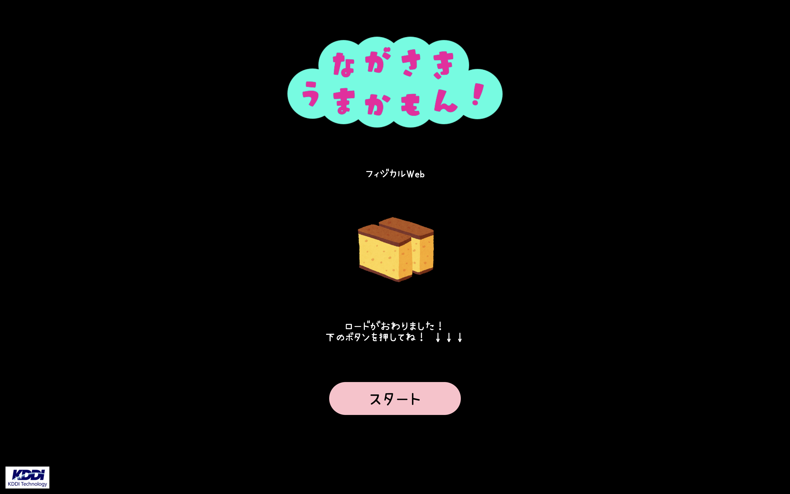
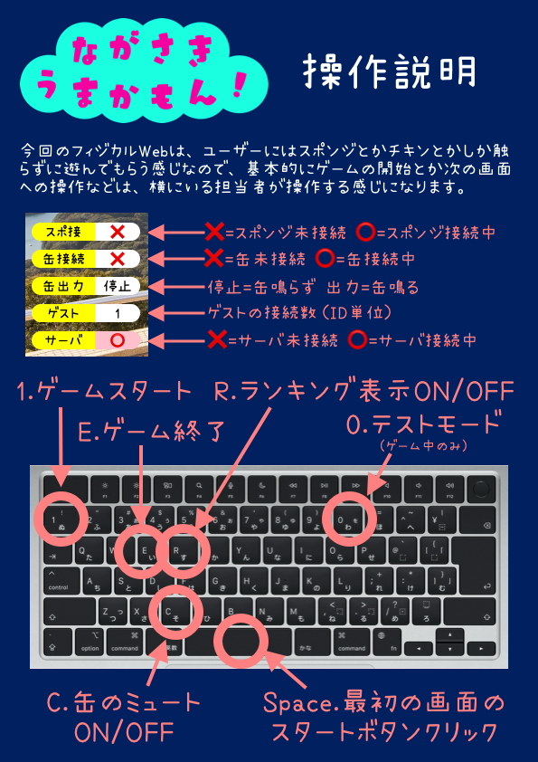
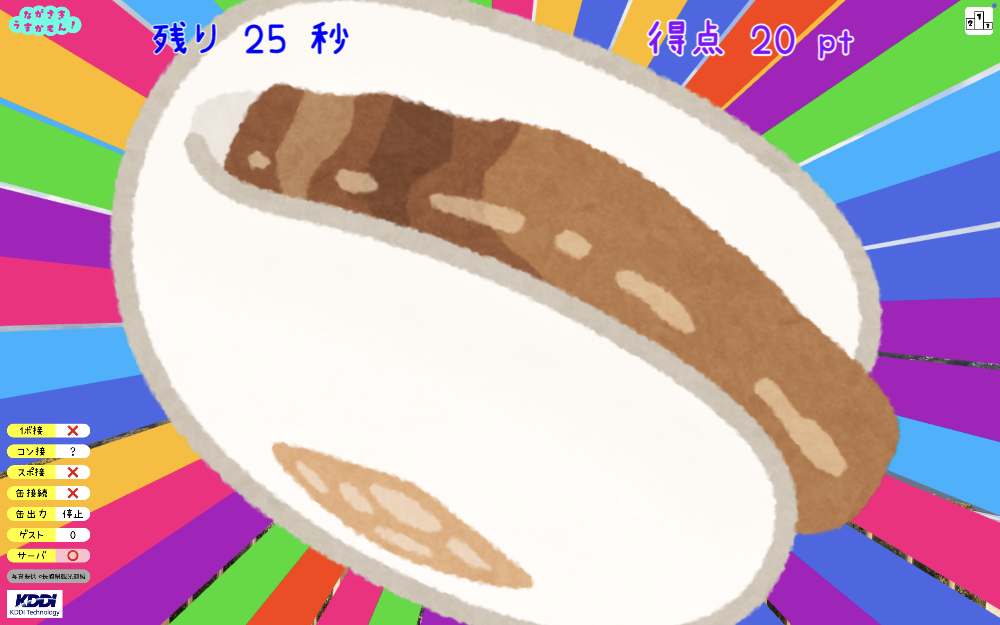

# sushi-app

ファミリーデーで展示予定の「sushi-app（仮称）」アプリについての簡単な説明書です。

## デプロイ方法

### 前提

デプロイ環境へ下記をインストールしておいてください。

- Git
- Node.js

[mise](https://mise.jdx.dev/)を利用して Node.js をインストールすることもできます。

```shell
cd susih-app2026
mise i
```

また、webへの公開の際には DNS や reverse proxy を別途設定ください。

### clone

```shell
git clone https://github.com/KDDI-Technology/sushi-app2026.git
```

### .env を編集

```shell
cd sushi-app2026
touch .env
```

`.env` を編集して保存します。  
下記のように、`BASIC_USER` と `BASIC_PASS` を設定してください。

```text
BASIC_USER=yourid
BASIC_PASS=yourpass
```

> `yourid` と `yourpass` を適当に設定してください。

### font配置

[kawaii手書き文字](https://font.spicy-sweet.com)を利用させて頂いております。  
`/www/libs` 直下に、上記配布サイトからダウンロードしたフォントを配置してご利用ください。

### 起動

```shell
cd sushi-app2026
npm start
```

これで `localhost:3179` を起動します。  
適宜、DNS や reverse proxy で接続してください。

## 操作説明

`npm start` すると、2つのアプリが起動します。

1. `localhost:3179/center` → コントローラや缶たたき機と接続したフィジカルWebアプリが起動します。展示用なので、`.env` で設定した basic認証が設定されます。
2. `localhost:3179/app` → こちらは公開用のスマホ対応アプリです。フィジカルWebの機能はありませんが、`localhost:3179/center` のプレイに横から複数人で参加できます。

### 1. `localhost:3179/center`　フィジカルWebアプリの操作方法

基本的に展示用のWebアプリなので、マウス等での操作ではなく、展示員が下記操作をすることでゲーム画面と待機画面を切り替えて参加者に遊んでいただきます。

#### 準備

このアプリは展示用なので、PC横画面に描画が最適化されています。  
また、フィジカルWebに一部のブラウザのみが対応している実験的な機能も利用しますので、基本的にはChromeブラウザの最新版をご利用ください。

フィジカルWebを実現するために、USBポートに下記デバイスを接続、構成してください。  
もちろん、別のデバイスを構成しても良いです。（アプリの修正が必要にはなります）

- 缶たたき機 = [mi:muz:can-rp2040](https://mz4u.net/mimuz-can) + ソレノイドを構成した複数の缶
- カステラコントローラ(非売品) [作り方1](https://qiita.com/tadfmac/items/ec70f8b9dcad3f5a1f97) [作り方2](https://qiita.com/tadfmac/items/f1ec79f7b570afd053f6)
- [叫ぶチキンコントローラー](https://capp.mz4u.net/chicken)
- USBゲームパッド [展示で利用したもの](https://www.amazon.co.jp/BUFFALO-USB%E3%82%B2%E3%83%BC%E3%83%A0%E3%83%91%E3%83%83%E3%83%89-8%E3%83%9C%E3%82%BF%E3%83%B3-%E3%82%B9%E3%83%BC%E3%83%91%E3%83%BC%E3%83%95%E3%82%A1%E3%83%9F%E3%82%B3%E3%83%B3%E9%A2%A8-%E3%82%B0%E3%83%AC%E3%83%BC/dp/B00RF10Z3O)

<!-- 上記に加え、長崎の展示では1点ものの自作1ボタンMIDIコンを追加していましたが、1点ものなので省略 -->

#### 1. 初期画面

起動後にリソースのロードが終わるとこの画面が表示されます。  
スペースキーを押して次の画面へ進んでください。



#### 2. 待機画面

次に待機画面が表示されます。


ゲーム開始できる状態になったら、`1` キーを押してゲームスタートです。

その他の操作は下記を参照してください。



#### 3. ゲーム画面

ゲーム開始するとカウントダウンの後に、30秒のゲームが始まります。


ゲーム中に接続されたコントローラー等を操作することで、得点が入ります。



#### 4. ゲーム終了画面

30秒経過するとゲーム終了です。  
これまでに獲得した点数が表示されます。


ランキングも表示された後に、ゲーム終了操作 `Eキーの押下`を行うことで、待機画面に戻ることができます。

### 2. `localhost:3179/app`　ゲストアプリの操作方法

主にスマホでの利用を想定したWebアプリです。  
こちらも起動後は初期画面が表示されます。  
[スタート]をタップして、待機画面へ遷移後、ただひたすら [飛ばす]を押し続けてください。

フィジカルWeb側でのゲーム中は得点がフィジカルWeb側にも加算されます。  
また、ゲスト同士も直近30分以内の上位3名のランキングが集計されます。  
ゲスト同士の得点の競争もお楽しみください。
